# ⚖️ Legal AI Assistant v2

A powerful AI-powered legal research and analysis assistant built with advanced multi-agent architecture. This system helps users understand legal concepts across multiple domains including Contract Law, Employment Law, Intellectual Property, Criminal Law, and Tort Law.

## 🆕 What's New in v2

### Enhanced Features from v1 → v2:
- **🏗️ Improved Architecture**: Restructured codebase with better separation of concerns
- **🎨 Enhanced UI**: Modern Streamlit interface with dark mode support and real-time visualizations
- **🔄 Advanced Workflow**: LangGraph-powered workflow orchestration with better error handling
- **📊 Real-time Analytics**: Live processing status, execution metrics, and workflow visualization
- **🧪 Comprehensive Testing**: Full test suite including integration and system tests
- **⚙️ Better Configuration**: Environment-based settings with advanced customization options
- **🔒 Enhanced Security**: Improved rate limiting and thread-safe operations
- **📱 Responsive Design**: Better mobile compatibility and accessibility features

### v1 Features (Maintained):
- ✅ Local AI processing
- ✅ Multi-agent coordination (Coordinator, Research, Analysis)
- ✅ Vector database with semantic search
- ✅ Auto-initialization of legal document database
- ✅ Support for multiple legal domains

### v2 New Features:
- 🆕 **Universal LLM Support**: Integrated LiteLLM for compatibility with 100+ AI providers
- 🆕 **Advanced Workflow Orchestration**: LangGraph state management
- 🆕 **Real-time Processing Visualization**: Live workflow status and metrics
- 🆕 **Enhanced Error Handling**: Robust retry mechanisms and error recovery
- 🆕 **Conversation History**: Persistent chat sessions with context awareness
- 🆕 **Advanced Analytics**: Processing time metrics and confidence scoring
- 🆕 **Provider Flexibility**: Support for OpenAI, Anthropic, Google, Azure, local models, and more

## 🛠️ Tech Stack

| Category | Technology | Purpose |
|----------|------------|---------|
| **Frontend** | [Streamlit](https://streamlit.io/) | Modern web interface with real-time updates |
| **AI Orchestration** | [LangGraph](https://langchain-ai.github.io/langgraph/) | Advanced workflow management and state handling |
| **LLM Integration** | [LiteLLM](https://litellm.ai/) | Universal interface for 100+ AI providers |
| **LLM Framework** | [LangChain](https://langchain.com/) | Large language model integration and tools |
| **Vector Database** | [ChromaDB](https://www.trychroma.com/) | Efficient document storage and similarity search |
| **Embeddings** | [SentenceTransformers](https://www.sbert.net/) | High-quality text embedding generation |
| **Local AI Options** | [LM Studio](https://lmstudio.ai/), [Ollama](https://ollama.ai/) | Local LLM hosting for privacy |
| **Cloud AI Options** | OpenAI, Anthropic, Google, Azure | Enterprise-grade cloud AI services |
| **Language** | Python 3.11+ | Core development with modern features |

### 🔧 Key Architecture Features:
- **Universal LLM Integration**: Support for 100+ AI providers via LiteLLM
- **Enhanced Multi-Agent System**: Improved coordination between agents
- **State Management**: Advanced workflow state tracking with LangGraph
- **Thread-Safe Operations**: Concurrent request handling with proper synchronization
- **Real-time Streaming**: Live response generation and status updates
- **Provider Flexibility**: Easy switching between local and cloud AI providers
- **Modular Design**: Clean separation of concerns for maintainability

## 🎬 Demo

Watch the Legal AI Assistant in action:


*The demo showcases the multi-agent workflow, real-time processing, and comprehensive legal analysis capabilities of the system.*

## 🔄 Workflow Architecture

The Legal AI Assistant follows a sophisticated multi-agent workflow orchestrated by LangGraph:

```mermaid
graph TD
    A[👤 User Query] --> B[🎯 Coordinator Agent]
    
    B --> C{📋 Domain Classification}
    C -->|Contract Law| D[📚 Research Agent]
    C -->|Employment Law| D
    C -->|IP Law| D
    C -->|Criminal Law| D
    C -->|Tort Law| D
    
    D --> E[🔍 Vector Database Search]
    E --> F[📖 Document Retrieval]
    F --> G[🧠 Analysis Agent]
    
    G --> H[💡 Legal Analysis]
    H --> I[📊 Confidence Scoring]
    I --> J[📝 Citation Generation]
    J --> K[✅ Final Response]
    
    K --> L[💬 Streamlit UI]
    
    subgraph "🏗️ LangGraph State Management"
        M[📊 State Tracking]
        N[🔄 Error Handling]
        O[📈 Progress Monitoring]
    end
    
    subgraph "🛠️ Supporting Systems"
        P[🗃️ ChromaDB Vector Store]
        Q[🤖 LM Studio Local AI]
        R[🔗 SentenceTransformers]
    end
    
    D -.-> M
    G -.-> N
    L -.-> O
    
    E -.-> P
    H -.-> Q
    F -.-> R
    
    style A fill:#e1f5fe
    style B fill:#f3e5f5
    style D fill:#e8f5e8
    style G fill:#fff3e0
    style K fill:#e0f2f1
    style L fill:#fce4ec
```



### 🔄 Workflow Stages:

1. **🎯 Coordination**: Query parsing and domain classification
2. **📚 Research**: Semantic search across legal document database
3. **🧠 Analysis**: Comprehensive legal analysis with context awareness
4. **📊 Response**: Formatted output with citations and confidence scores

Each stage maintains state through LangGraph, enabling robust error handling, progress tracking, and seamless agent communication.

## 🚀 Quick Start

### Prerequisites
- Python 3.11+
- LM Studio (for local AI model)
- Git

### 1. Clone and Setup
```bash
git clone https://github.com/albingcj/legal-ai-agents.git
cd legal-ai-agents
```

### 2. Create Virtual Environment
```bash
python -m venv env
```

### 3. Activate Environment
**Windows (PowerShell):**
```powershell
.\env\Scripts\activate
```

**Windows (Command Prompt):**
```cmd
env\Scripts\activate.bat
```

**Mac/Linux:**
```bash
source env/bin/activate
```

### 4. Install Dependencies
```bash
pip install -r requirements.txt
```

### 5. Environment Configuration
Create a `.env` file in the project root by copying the example:
```bash
cp .env.example .env
```

**Choose ONE of the following LLM provider configurations:**

#### Option 1: Google Gemini (Latest AI capabilities) - Recommended
```env
# Latest Google AI with excellent performance
LLM_MODEL=gemini/gemini-2.0-flash
LLM_API_KEY=your-google-api-key-here
```

#### Option 2: LM Studio (Local/Privacy-focused)
```env
# Local AI with complete privacy
LLM_MODEL=openai/local-model
LM_STUDIO_BASE_URL=http://localhost:1234
LM_STUDIO_API_KEY=not-needed
```

#### Option 3: OpenAI (Easy setup)
```env
# Cloud-based AI with excellent performance
LLM_MODEL=openai/gpt-3.5-turbo
LLM_API_KEY=your-openai-api-key-here
```

#### Option 4: Anthropic Claude (Best for legal reasoning)
```env
# Excellent for complex legal analysis
LLM_MODEL=anthropic/claude-3-sonnet-20240229
LLM_API_KEY=your-anthropic-api-key-here
```

#### Option 5: Ollama (Local alternative)
```env
# Another local option via Ollama
LLM_MODEL=ollama/llama2
LLM_API_BASE=http://localhost:11434
```

**Optional Advanced Settings:**
```env
# Fine-tune LLM behavior
LLM_TEMPERATURE=0.1          # Response creativity (0.0-1.0)
LLM_MAX_TOKENS=1000         # Maximum response length

# Database settings
CHROMA_DB_PATH=./chroma_db
```

### 6. Setup Your Chosen LLM Provider

#### For Google Gemini (Recommended for latest AI):
1. Get API key from [Google AI Studio](https://aistudio.google.com/app/apikey)
2. Click "Create API Key" and copy the generated key
3. Add to your .env file: `LLM_API_KEY=your-actual-api-key`
4. Gemini 2.0 Flash offers excellent speed and capabilities

#### For LM Studio (Recommended for privacy):
1. Download and install [LM Studio](https://lmstudio.ai/)
2. Download a compatible chat model (e.g., Llama-2, Mistral, Phi-3)
3. Go to "Local Server" tab and start the server on port 1234
4. Load your chosen model

#### For Other Cloud Providers:
- **OpenAI**: Get API key from [OpenAI Platform](https://platform.openai.com/api-keys)
- **Anthropic**: Get API key from [Anthropic Console](https://console.anthropic.com/)

#### For Ollama:
1. Install [Ollama](https://ollama.ai/)
2. Pull a model: `ollama pull llama2`
3. Start Ollama server

### 7. Run the Application
```bash
streamlit run ui/streamlit_app.py
```

The application will automatically:
- ✅ Initialize the legal document database on first run
- 📊 Load sample legal documents into the vector database
- 🚀 Start the enhanced web interface at `http://localhost:8501`

> **Note**: The first startup may take a few extra seconds to initialize the database. Subsequent runs will be faster as the database is already set up.

## 📚 Adding More Legal Documents

### Method 1: Using the Document Loader (Recommended)
Add documents programmatically by modifying the sample documents in `tools/document_loader.py`:

```python
# Add your documents to the sample_docs list in load_sample_documents()
{
    "title": "Your Legal Topic",
    "content": """
    Your legal content here...
    """,
    "source": "Source Reference",
    "type": "legal_principle",  # or "case_law", "statute", etc.
    "domain": "contract_law"  # or other supported domain
}
```

Then restart the application:
```bash
streamlit run ui/streamlit_app.py
```

### Method 2: Direct Database Addition
```python
from tools.vector_store import LegalVectorStore

vector_store = LegalVectorStore()

# Add single document
vector_store.add_documents(
    documents=["Your legal document content"],
    metadata=[{
        "title": "Document Title",
        "source": "Source",
        "domain": "contract_law",
        "type": "legal_principle"
    }]
)
```

### Method 3: File-based Loading
Create text files in the `data/legal_documents/` directory and use:
```python
from tools.document_loader import LegalDocumentLoader

loader = LegalDocumentLoader()
docs = loader.load_documents_from_directory("data/legal_documents/")
# Process and add to vector store...
```

## 🏗️ Project Structure

```
legal-ai-agents/
├── ui/
│   └── streamlit_app.py     # Enhanced Streamlit application with v2 features
├── requirements.txt         # Updated Python dependencies
├── .env                    # Environment configuration
├── README.md               # This file (v2)
│
├── agents/                 # Enhanced AI agent modules
│   ├── __init__.py
│   ├── base_agent.py       # Improved base agent class
│   ├── coordinator.py      # Enhanced query coordination
│   ├── research_agent.py   # Advanced legal research
│   └── analysis_agent.py   # Comprehensive legal analysis
│
├── workflows/              # LangGraph workflow orchestration
│   ├── __init__.py
│   └── legal_workflow.py   # Advanced workflow with state management
│
├── tools/                  # Enhanced utility tools
│   ├── __init__.py
│   ├── document_loader.py  # Improved document loading
│   ├── vector_store.py     # Enhanced vector database operations
│   └── llm_client.py       # Advanced LLM client with streaming
│
├── config/                 # Configuration management
│   └── settings.py         # Comprehensive app settings
│
├── utils/                  # Utility functions
│   └── helpers.py          # Enhanced helper functions
│
├── tests/                  # Comprehensive test suite
│   ├── test_complete_system.py    # System integration tests
│   ├── test_integration.py        # Component integration tests
│   └── test_research_agent.py     # Unit tests
│
├── chroma_db/              # Vector database (auto-created)
├── data/                   # Document storage (auto-created)
│   └── legal_documents/
└── env/                    # Virtual environment
```

## 🎯 Supported Legal Domains

- **📋 Contract Law**: Formation, breach, remedies, consideration
- **👥 Employment Law**: Workplace rights, termination, discrimination, at-will employment
- **🔮 Intellectual Property**: Copyright, patents, trademarks, fair use
- **⚖️ Criminal Law**: Procedures, rights, defenses, Miranda rights
- **🏥 Tort Law**: Negligence, liability, damages, personal injury

## 🤖 Creating and Adding New Agents

The system is designed with extensibility in mind. You can easily add new specialized agents to handle specific legal domains or tasks.

### Agent Architecture Overview

The current workflow uses three core agents:
1. **CoordinatorAgent**: Parses queries and determines legal domain
2. **ResearchAgent**: Searches legal documents and extracts relevant information
3. **AnalysisAgent**: Provides comprehensive legal analysis and citations

### Creating a New Agent

#### Step 1: Create the Agent Class

Create a new file in the `agents/` directory (e.g., `agents/citation_agent.py`):

```python
from typing import Dict, Any
from .base_agent import BaseAgent
from tools.llm_client import LMStudioClient

class CitationAgent(BaseAgent):
    def __init__(self):
        super().__init__(
            name="Citation",
            description="Formats and validates legal citations"
        )
        self.llm_client = LMStudioClient()
    
    def process(self, state: Dict[str, Any]) -> Dict[str, Any]:
        """Format legal citations from research results"""
        self.log("Starting citation formatting process")
        
        # Validate required inputs
        if not self.validate_state(state, ['research_results']):
            state['error'] = "Missing research results for citation formatting"
            return state
        
        try:
            # Your custom logic here
            research_results = state.get('research_results', [])
            formatted_citations = self.format_citations(research_results)
            
            # Update state with results
            state.update({
                'formatted_citations': formatted_citations,
                'citation_count': len(formatted_citations),
                'citation_status': 'completed'
            })
            
            self.log(f"Formatted {len(formatted_citations)} citations")
            
        except Exception as e:
            self.log(f"Citation formatting error: {str(e)}", "ERROR")
            state['error'] = f"Citation formatting failed: {str(e)}"
            state['citation_status'] = 'failed'
        
        return state
    
    def format_citations(self, research_results):
        """Custom citation formatting logic"""
        citations = []
        for result in research_results:
            # Add your formatting logic here
            citation = {
                'title': result.get('title', 'Unknown'),
                'source': result.get('source', 'Unknown'),
                'relevance': result.get('relevance', 0.0),
                'formatted': f"{result.get('title', 'Unknown')} - {result.get('source', 'Unknown')}"
            }
            citations.append(citation)
        return citations
```

#### Step 2: Update Workflow State

Add new state fields to `workflows/legal_workflow.py` in the `LegalWorkflowState` class:

```python
class LegalWorkflowState(TypedDict):
    # ...existing fields...
    
    # Citation agent outputs
    formatted_citations: Optional[List[Dict]]
    citation_count: Optional[int]
    citation_status: Optional[str]
```

#### Step 3: Create Workflow Node

Add a new node function in `workflows/legal_workflow.py`:

```python
def citation_node(state: LegalWorkflowState) -> LegalWorkflowState:
    """Process citations through citation agent"""
    logger.info("Executing citation node")
    
    try:
        # Initialize citation agent
        citation_agent = CitationAgent()
        
        # Update state
        state['current_step'] = 'citation_formatting'
        
        # Process through citation agent
        result_state = citation_agent.process(dict(state))
        
        # Merge results back to state
        for key, value in result_state.items():
            state[key] = value
        
        # Add agent logs
        if 'agent_logs' not in state:
            state['agent_logs'] = []
        
        state['agent_logs'].append({
            'agent': 'citation',
            'timestamp': datetime.now().isoformat(),
            'status': 'completed' if not state.get('error') else 'failed',
            'details': citation_agent.get_agent_info()
        })
        
        logger.info("Citation node completed successfully")
        
    except Exception as e:
        logger.error(f"Citation node error: {str(e)}")
        state['error'] = f"Citation agent failed: {str(e)}"
        
    return state
```

#### Step 4: Integrate into Workflow Graph

Update the `create_workflow()` function in `workflows/legal_workflow.py`:

```python
def create_workflow():
    """Create the legal workflow graph with new agent"""
    workflow = StateGraph(LegalWorkflowState)
    
    # Add existing nodes
    workflow.add_node("coordinator", coordinator_node)
    workflow.add_node("research", research_node)
    workflow.add_node("citation", citation_node)  # New node
    workflow.add_node("analysis", analysis_node)
    
    # Update workflow edges
    workflow.add_edge(START, "coordinator")
    workflow.add_edge("coordinator", "research")
    workflow.add_edge("research", "citation")     # New edge
    workflow.add_edge("citation", "analysis")     # Updated edge
    workflow.add_edge("analysis", END)
    
    return workflow.compile()
```

#### Step 5: Update Agent Imports

Add the import to `workflows/legal_workflow.py`:

```python
from agents.coordinator import CoordinatorAgent
from agents.research_agent import ResearchAgent
from agents.citation_agent import CitationAgent  # New import
from agents.analysis_agent import AnalysisAgent
```

### Advanced Agent Features

#### Custom Tool Integration
Agents can use specialized tools:

```python
class SpecializedAgent(BaseAgent):
    def __init__(self):
        super().__init__(name="Specialized", description="Specialized processing")
        self.custom_tool = CustomTool()  # Your custom tool
    
    def process(self, state: Dict[str, Any]) -> Dict[str, Any]:
        # Use custom tools
        result = self.custom_tool.process(state.get('query'))
        state['specialized_result'] = result
        return state
```

#### Conditional Workflow Routing
Add conditional logic to determine which agents to use:

```python
def should_use_citation_agent(state: LegalWorkflowState) -> bool:
    """Determine if citation agent should be used"""
    return len(state.get('research_results', [])) > 3

# In create_workflow():
workflow.add_conditional_edges(
    "research",
    should_use_citation_agent,
    {
        True: "citation",
        False: "analysis"
    }
)
```

#### Agent Communication
Agents can pass specific data to each other:

```python
def research_node(state: LegalWorkflowState) -> LegalWorkflowState:
    # ...existing code...
    
    # Pass specific data to next agent
    state['research_metadata'] = {
        'search_strategy': 'comprehensive',
        'confidence_threshold': 0.7,
        'preferred_sources': ['case_law', 'statutes']
    }
    
    return state
```

### Testing New Agents

Create tests for your new agent in `tests/`:

```python
# tests/test_citation_agent.py
import pytest
from agents.citation_agent import CitationAgent

def test_citation_agent_basic():
    agent = CitationAgent()
    state = {
        'research_results': [
            {'title': 'Test Case', 'source': 'Test Court', 'relevance': 0.9}
        ]
    }
    
    result = agent.process(state)
    
    assert 'formatted_citations' in result
    assert result['citation_count'] == 1
    assert result['citation_status'] == 'completed'
```

### Best Practices for Agent Development

1. **🔍 Single Responsibility**: Each agent should have one clear purpose
2. **🔗 State Management**: Always validate input state and update output state properly
3. **🚨 Error Handling**: Implement robust error handling with meaningful messages
4. **📊 Logging**: Use the built-in logging system for debugging and monitoring
5. **🧪 Testing**: Write comprehensive tests for your agent logic
6. **📚 Documentation**: Document your agent's purpose, inputs, and outputs
7. **⚡ Performance**: Consider processing time and optimize for efficiency
8. **🔒 Thread Safety**: Ensure your agent can handle concurrent requests

### Example: Adding a Legal Research Validation Agent

```python
# agents/validation_agent.py
class ValidationAgent(BaseAgent):
    def __init__(self):
        super().__init__(
            name="Validation",
            description="Validates legal research accuracy and completeness"
        )
    
    def process(self, state: Dict[str, Any]) -> Dict[str, Any]:
        # Validate research quality
        research_results = state.get('research_results', [])
        validation_score = self.calculate_validation_score(research_results)
        
        state.update({
            'validation_score': validation_score,
            'validation_status': 'completed',
            'quality_metrics': {
                'source_diversity': self.check_source_diversity(research_results),
                'relevance_threshold': self.check_relevance_threshold(research_results),
                'citation_quality': self.check_citation_quality(research_results)
            }
        })
        
        return state
```

This modular approach allows you to extend the system with specialized agents for:
- **Document Summarization**: Summarizing long legal documents
- **Precedent Analysis**: Finding and analyzing legal precedents
- **Risk Assessment**: Evaluating legal risks in different scenarios
- **Compliance Checking**: Checking regulatory compliance
- **Contract Analysis**: Specialized contract review and analysis

## 🔧 Configuration Options

Edit `.env` file or `config/settings.py` to customize:

| Setting | Default | Description |
|---------|---------|-------------|
| `LM_STUDIO_BASE_URL` | `http://localhost:1234` | LM Studio server URL |
| `CHROMA_DB_PATH` | `./chroma_db` | Vector database location |
| `EMBEDDING_MODEL` | `all-MiniLM-L6-v2` | Sentence transformer model |
| `MAX_RETRIEVED_DOCS` | `8` | Max documents per query |
| `TEMPERATURE` | `0.1` | AI response creativity |
| `DEBUG` | `False` | Enable debug logging |

## 🧪 Testing

Run the comprehensive test suite:
```bash
# Run all tests
python -m pytest tests/ -v

# Test complete system functionality
python tests/test_complete_system.py

# Test component integration
python tests/test_integration.py

# Test individual agents
python tests/test_research_agent.py

# Test workflow manually
python workflows/legal_workflow.py
```

## 🔍 Usage Examples

### Example Queries:
- "What are the requirements for a valid contract?"
- "Can my employer terminate me without cause?"
- "How does copyright fair use work?"
- "What are Miranda rights in criminal law?"
- "When is someone liable for negligence?"
- "What is the statute of limitations for personal injury?"

## 🛠️ Troubleshooting

### Common Issues:

**1. ModuleNotFoundError: No module named 'agents'**
- Make sure you're running from the project root directory
- Use `streamlit run ui/streamlit_app.py` instead of running workflow files directly

**2. LM Studio Connection Error**
- Ensure LM Studio is running on port 1234
- Check that a model is loaded in LM Studio
- Verify the `LM_STUDIO_BASE_URL` in your `.env` file

**3. Database Issues**
- The app automatically initializes the database on first run
- If you see database errors, delete the `chroma_db` folder and restart the app
- Check that the project directory has write permissions

**4. Dependencies Issues**
- Ensure you're in the virtual environment: `.\env\Scripts\activate`
- Reinstall requirements: `pip install -r requirements.txt --force-reinstall`

### Reset Everything:
```bash
# Clear database (Windows PowerShell)
Remove-Item -Recurse -Force chroma_db

# Or for Unix/Mac/Linux
rm -rf chroma_db/

# Reinstall dependencies
pip install -r requirements.txt --force-reinstall

# Restart the app (database will be automatically reinitialized)
streamlit run ui/streamlit_app.py
```

## 📈 Performance & Metrics

v2 includes enhanced performance monitoring:
- Real-time processing time tracking
- Confidence scoring for responses
- Workflow execution metrics
- Error rate monitoring
- Database query performance

## 🔐 Security & Privacy

- **Local Processing**: All AI processing happens locally (no external API calls)
- **Data Privacy**: Legal queries and documents stay on your machine
- **Rate Limiting**: Built-in protection against request flooding
- **Thread Safety**: Secure concurrent request handling

---

**Built with**: Python 3.11+, Streamlit, LangGraph, LangChain, ChromaDB, SentenceTransformers, LM Studio

**Disclaimer:** This tool provides legal information, not legal advice. Consult a qualified attorney for legal matters.
